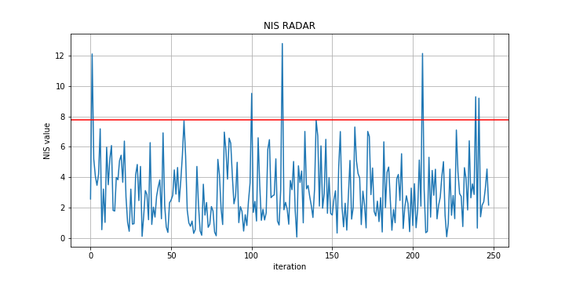
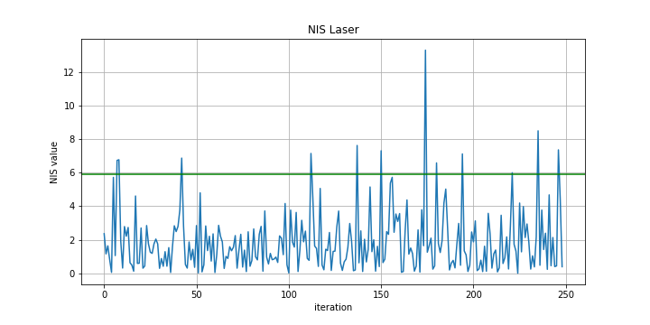
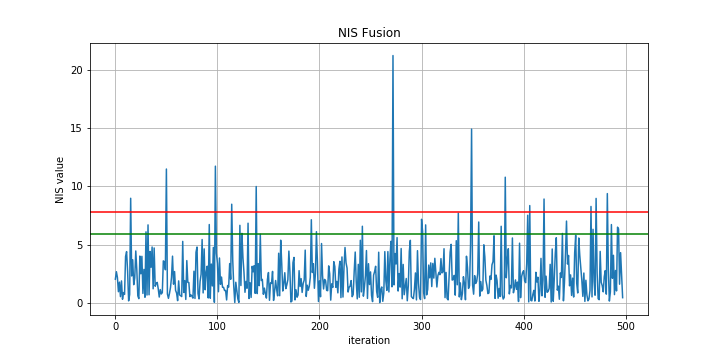
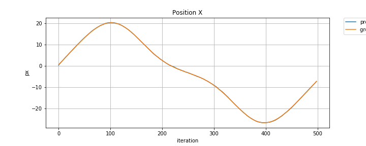
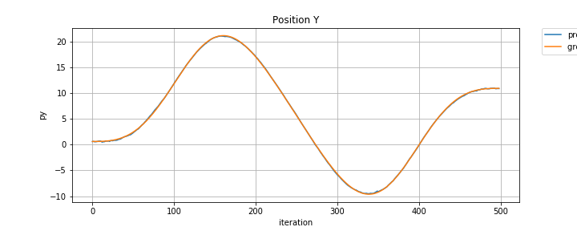
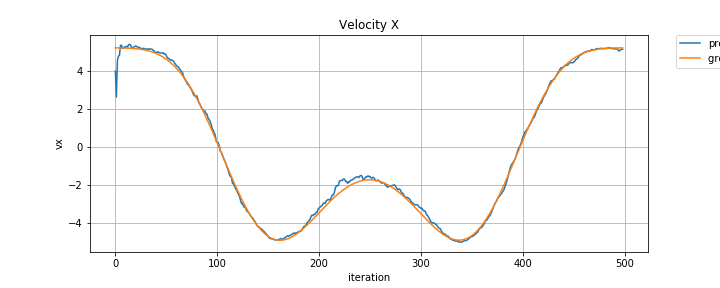
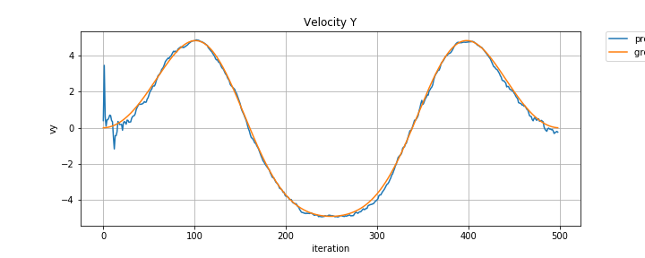
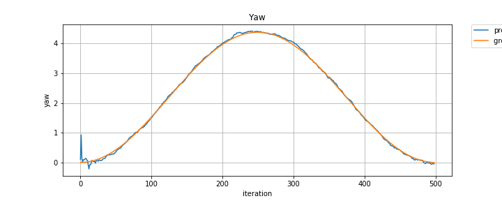
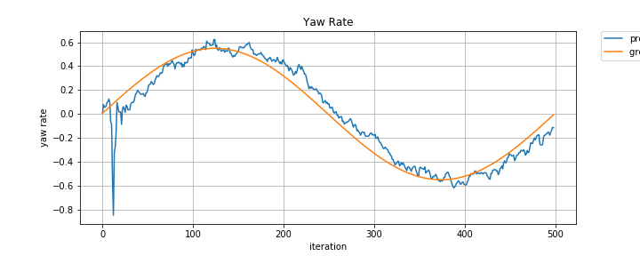

# Extended Kalman Filters

### This project pass through these steps:

* Receives the first measurement and initializes the state, both for **LIDAR** and for **RADAR**
* Receive the next measurement, predicts sigma points and then updates the state, repeating this cycle continuously.

### Rubric points

#### 1. RMSE <= [.09, .10, .40, .30]

**RMSE RADAR** 
The final values obtained using only the RADAR sensor were `[.17, .18, .76, .32]`

**RMSE LIDAR**
The final values obtained using only the LIDAR sensor were
`[.094, .096, .24, .24]`

**RMSE Fusion**
The final values obtained using both sensors were `[.06, .08, .19, .23]`

#### 2. Kalman Filter algorithm handles the first measurements appropriately

The state vector `x_` consists of the following values

**px** -> position in x axis <br/>
**py** -> position in y axis <br/>
**v ->** speed (magnitude of the velocity) <br/>
**yaw ->** orientation <br/>
**yaw rate ->** orientation rate

For initialization using LIDAR as the first measurement, we just need to assign `px` and `py` directly to state vector, because the LIDAR measurement is received in Cartesian coordinates. However when we receive a measurement of the RADAR sensor, we need to convert from polar coordinates to Cartesian. Os valores `v`, `yaw` e `yaw rate` foram escolhidos empiricamente

**LIDAR**

```c++
if (meas_package.sensor_type_ == meas_package.LASER) {
  x_ << meas_package.raw_measurements_[0], 
        meas_package.raw_measurements_[1], 
        4.0, 
        0.1, 
        0.01;
}
```

**RADAR**

```c++
else if (meas_package.sensor_type_ == meas_package.RADAR) {
  float rho = meas_package.raw_measurements_[0];
  float phi = meas_package.raw_measurements_[1];
  // Convert radar from polar to cartesian coordinates and initialize state.
  float px = rho * cos(phi);
  float py = rho * sin(phi);

  x_ << px, py, 4.0, 0.1, 0.01;
}
```

#### Consistency check

I checked the consistency of the parameters using Normalized Innovation Squared (NIS). First it was verified only with the RADAR sensor turned on, then with the LIDAR sensor and finally with the two sensors on







Here is a comparison between the predictions and the ground truth













### Notes

To generate the graphics I created a project in python. The code is in[plots.ipynb](https://github.com/matheuslrsouza/CarND-Unscented-Kalman-Filter-Project/tree/master/plots/plots.ipynb)